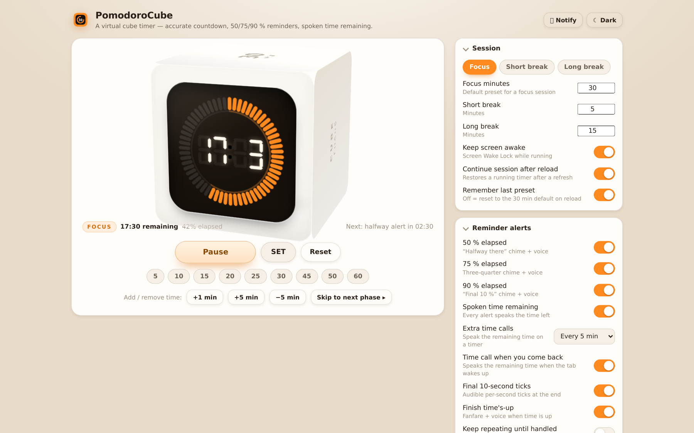

<div align="center">

# 🧊 PomodoroCube

**A virtual pomodoro cube timer for the browser — accurate countdown, 50 / 75 / 90 % reminders, spoken time remaining.**




</div>

A cube-shaped timer inspired by the little physical flip-cube timers: a 7-segment
display wrapped in a 60-tick progress ring, sitting on the front face of a 3D cube.
The preset defaults to **30 minutes** and is fully adjustable — including the
**SET → M / S → SET** flow from the real device.

Everything runs in the browser. No accounts, no server, no tracking, no
dependencies, no build step. Publish it free on GitHub Pages and it also installs
as an offline PWA.

---

## Why this one is accurate

Timers are easy to get wrong: most simple ones count `setInterval` ticks, so they
lose a little time whenever the tab is throttled and drift badly over a session.
PomodoroCube never counts ticks.

* **Absolute deadline.** The countdown is `deadline − Date.now()`. Rendering can
  be late or skipped entirely and the remaining time is still exact.
* **Precise event scheduling.** Every pending alert also gets a `setTimeout`
  aimed at its exact instant (median error < 2 ms even when it is sleeping).
* **Web Worker ticks.** A worker drives 100 ms ticks so the timer keeps ticking
  while a background tab is throttled, with a main-thread fallback.
* **Catch-up, never skip.** If the device slept through an alert, it fires the
  moment the page runs again — and the lateness is measured and reported instead
  of being hidden.
* **Verifiable.** Open `index.html?test=1` and the built-in test suite measures
  punctuality, a frozen tab, pause/resume and the SET flow on *your* device.

Measured on desktop Chrome (headless, idle machine), 20-second runs:

| Test | Result |
| --- | --- |
| 50 % alert | fired **0 ms** after its exact target |
| 75 % alert | fired **1 ms** after its exact target |
| 90 % alert | fired **0 ms** after its exact target |
| finish | fired **0 ms** after its exact target |
| main thread frozen for 11 s | remaining time off by **0 ms**, finish still **0 ms** late, the covered alert caught up and reported |
| pause 3 s then resume | wall time = run time + paused time (exact) |
| SET / ± buttons | exact to the millisecond |

*20/20 checks passed. Reproduce it yourself: `?test=1`, or read
[docs/accuracy.md](docs/accuracy.md) for the full method and caveats.*

---

## Features

**Visualisation**
* 3D cube with printed `30 MIN` top face, phase label on the side, and a dark
  display on the front — click the cube to start or pause.
* Real 7-segment digits built from SVG polygons (not a font), with ghosted
  unlit segments.
* 60-tick progress ring: lit ticks count down one per minute, with a hairline
  arc for sub-minute precision. The whole ring turns red in the final 10 %.
* Progress chip, remaining/elapsed readout, and a **“Next: halfway alert in
  02:30”** countdown so you always know what is coming.

**Reminder alerts**
* Chimes at **50 %**, **75 %** and **90 %**, each with its own melody.
* Spoken announcement of the **time remaining** with every alert
  (“*Seventy-five percent done. Seven minutes, thirty seconds remaining.*”).
* Optional extra time calls every 2 / 5 / 10 / 15 minutes, plus a spoken
  remainder when you return to the tab.
* Final 10-second ticks, a finish fanfare, optional repeat-until-handled, and a
  “time's up” reminder card with **Start break** / **+5 min** actions.
* Desktop notifications, phone vibration, and a flashing tab title.

**Control**
* Default preset **30:00**, adjustable to any minute/second (1 s – 12 h).
* SET flow, quick presets (5–60 min), ±1 min / ±5 min while running, pause,
  reset, focus / short break / long break phases, and full keyboard control.
* SET and settings are remembered (unless you turn that off), a running session
  survives a reload, and the screen can be kept awake while the timer runs.

## Quick start

**Use it**

* Open the deployed page (replace `mikefromcornell` after publishing):
  `https://mikefromcornell.github.io/PomodoroCube/`
* Or just open `index.html` — no server, no install, works offline.

**Run it locally**

```bash
git clone https://github.com/mikefromcornell/PomodoroCube.git
cd PomodoroCube
npm start                 # → http://localhost:8080   (zero-dependency static server)
# or simply: open index.html
```

```bash
npm run check             # syntax + consistency checks, no dependencies
open "http://localhost:8080/?test=1"   # the accuracy test suite
```

**Publish it free (GitHub Pages)**

1. Create an empty repository named `PomodoroCube` on GitHub.
2. `git remote add origin https://github.com/mikefromcornell/PomodoroCube.git && git push -u origin main`
3. **Settings → Pages → Source: GitHub Actions** (the included workflow does the rest).

Full walkthrough, including custom domains and alternatives to Pages:
[docs/publishing.md](docs/publishing.md).

## Using the timer

| Action | How |
| --- | --- |
| Start / pause | **Space**, or click the cube, or the **Start** button |
| Set the preset (SET flow) | **S** → adjust **M** / **S** → **SET** to confirm, **Esc** to cancel |
| Quick preset | Click a chip: 5, 10, 15, 20, 25, 30, 45, 50, 60 minutes |
| Change time on the fly | **+1 min**, **+5 min**, **−5 min** — works while running, paused or idle |
| Nudge | **↑/↓** = ±1 minute, **←/→** = ±10 seconds |
| Switch phase | **1** focus · **2** short break · **3** long break |
| Reset | **R** |
| Test the alerts | **T** |
| Skip ahead | **Skip to next phase** |

The **Reminder alerts** panel toggles each alert independently; **Accuracy** shows
live diagnostics (tick gap, worst alert lateness, throttled gaps, clock jumps).

## How alerts behave

| Moment | Chime | Voice | Card |
| --- | --- | --- | --- |
| 50 % elapsed | soft two-note | “Halfway there. Fifteen minutes remaining in your focus.” | ✓ |
| 75 % elapsed | rising three-note | “Seventy-five percent done. Seven minutes, thirty seconds remaining.” | ✓ |
| 90 % elapsed | bright double ping | “Ten percent left. Three minutes remaining.” | ✓ |
| every N minutes (optional) | ping | “Twenty minutes remaining.” | ✓ |
| last 10 seconds (optional) | per-second tick | — | — |
| finish | four-note fanfare | “Time's up. Your 30 minute focus session is complete.” | sticky + actions |

Details, tuning and troubleshooting: [docs/reminders.md](docs/reminders.md).

## Project layout

```
PomodoroCube/
├── index.html               # the whole UI (one page, no framework)
├── src/
│   ├── app.js               # timer engine, alerts, voice, cube rendering
│   └── styles.css           # design tokens, cube, light/dark themes
├── assets/                  # SVG + PNG icons, favicon
├── tests/accuracy.test.js   # built-in test suite  (?test=1)
├── tools/                   # serve.mjs, check.mjs, publish.mjs — all dependency-free
├── manifest.webmanifest     # PWA install metadata
├── sw.js                    # offline service worker
└── docs/                    # accuracy, reminders, publishing, architecture
```

## Privacy

No analytics, no cookies, no network requests at all — the page loads only its
own files. Settings live in your browser's `localStorage`; nothing is uploaded
and nothing leaves your device. Alerts use the built-in Web Audio and
Speech Synthesis APIs, so no audio files are fetched.

## Browser support

Chrome / Edge 88+, Firefox 90+, Safari 15.4+ (desktop and mobile). Voice alerts
need a browser with Speech Synthesis; chimes need Web Audio. Both degrade
gracefully — every alert is also a visible card. iOS Safari needs one tap on the
page before audio is allowed, which the app primes on the first interaction.

## Contributing

Issues and pull requests are welcome — see [CONTRIBUTING.md](CONTRIBUTING.md).
The project deliberately has **zero dependencies and no build step**; please keep
it that way.

## License

[MIT](LICENSE) — free to use, modify, publish and sell. Have fun focusing.
